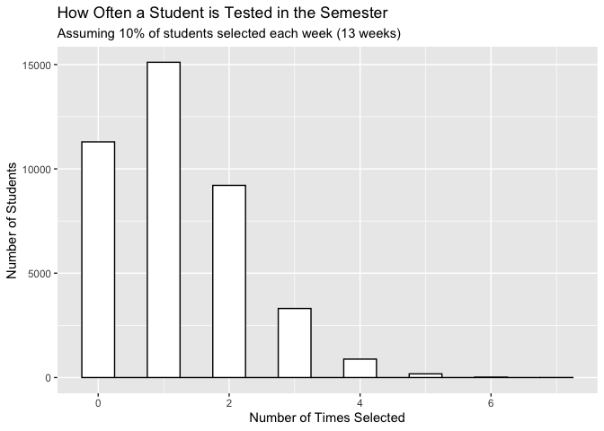

Random COVID testing simulation
================

Each week of the 13-week Fall Semester, Purdue University randomly tests
10% of its students for COVID. Assuming students are selected randomly,
draw a histogram showing the number of students who are tested, binned
by the number of times they are tested in the semester.

Set up a dataframe to simulate 13 weeks of testing. Each row is a
student; each column is a week. The contents of each cell is the number
of times the student was tested that week.

``` r
library(tidyverse)
library(scales)

PURDUE_STUDENT_POPULATION <- 40000
SEMESTER_WEEKS <-13
PERCENT_SELECTED <- 0.10
weekly_selected <- PURDUE_STUDENT_POPULATION * PERCENT_SELECTED

simulate_semester <- function() {
students_tested <- tibble(student = 1:PURDUE_STUDENT_POPULATION)  %>%
  add_column(week1=0) %>% 
  add_column(week2=0) %>% 
  add_column(week3=0) %>% 
  add_column(week4=0) %>% 
  add_column(week5=0) %>% 
  add_column(week6=0) %>% 
  add_column(week7=0) %>% 
  add_column(week8=0) %>% 
  add_column(week9=0) %>% 
  add_column(week10=0) %>% 
  add_column(week11=0) %>% 
  add_column(week12=0) %>% 
  add_column(total = 0)

students_tested[sample(1:nrow(students_tested),weekly_selected),2] <- 1
students_tested[sample(1:nrow(students_tested),weekly_selected),3] <- 1
students_tested[sample(1:nrow(students_tested),weekly_selected),4] <- 1
students_tested[sample(1:nrow(students_tested),weekly_selected),5] <- 1
students_tested[sample(1:nrow(students_tested),weekly_selected),6] <- 1
students_tested[sample(1:nrow(students_tested),weekly_selected),7] <- 1
students_tested[sample(1:nrow(students_tested),weekly_selected),8] <- 1
students_tested[sample(1:nrow(students_tested),weekly_selected),9] <- 1
students_tested[sample(1:nrow(students_tested),weekly_selected),10] <- 1
students_tested[sample(1:nrow(students_tested),weekly_selected),11] <- 1
students_tested[sample(1:nrow(students_tested),weekly_selected),12] <- 1
students_tested[sample(1:nrow(students_tested),weekly_selected),13] <- 1
students_tested[,14] <- students_tested[,-1] %>% rowSums() 
students_tested

}
```

``` r
simulate_semester() %>% ggplot(aes(x=total)) + geom_histogram( color="black", fill="white", bins = 15) +
  #scale_y_discrete(labels = label_comma() ) +
  labs(title = "How Often a Student is Tested in the Semester", subtitle = "Assuming 10% of students selected each week (13 weeks)", x = "Number of Times Selected", y = "Number of Students")
```

<!-- -->

``` r
simulate_semester() %>% pull(total) %>% table() %>% as.vector()
```

    ## [1] 11213 15202  9160  3400   874   124    27
