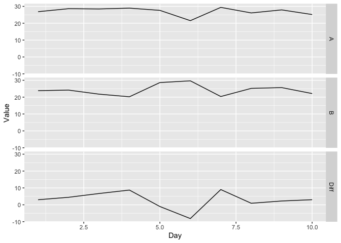
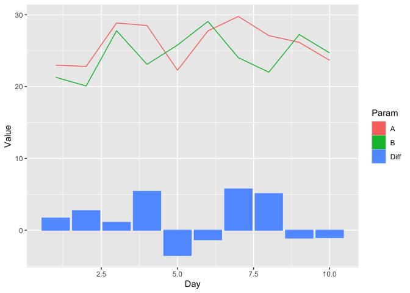
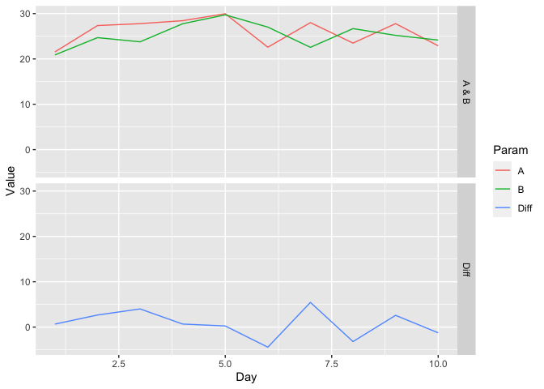
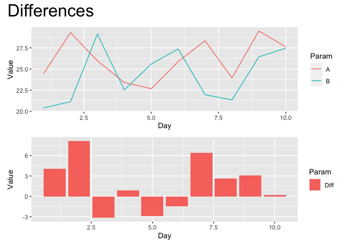

Understanding facet_grid()
================

``` r
library(tidyverse)

tibble(Day = 1:10, A = runif(10,20,30), B = runif(10,20,30), Diff = A-B) %>%
  pivot_longer(-Day, names_to = "Param", values_to = "Value") %>%
  ggplot(aes(x = Day, y = Value, fill = Param)) +
  geom_line() +
  facet_grid(rows = "Param")
```

<!-- -->

I would like to combine A and B into one geom_line() plot, with Diff a
separate geom_col() plot, all in the same face_grid

``` r
tibble(Day = 1:10, A = runif(10,20,30), B = runif(10,20,30), Diff = A-B) %>%
  pivot_longer(-Day, names_to = "Param", values_to = "Value")
```

    ## # A tibble: 30 × 3
    ##      Day Param  Value
    ##    <int> <chr>  <dbl>
    ##  1     1 A     24.4  
    ##  2     1 B     24.9  
    ##  3     1 Diff  -0.437
    ##  4     2 A     21.0  
    ##  5     2 B     21.2  
    ##  6     2 Diff  -0.185
    ##  7     3 A     27.1  
    ##  8     3 B     26.8  
    ##  9     3 Diff   0.309
    ## 10     4 A     20.6  
    ## # … with 20 more rows

``` r
## solutions by jonthegeek: https://rfordatascience.slack.com/archives/C8JRJSW4S/p1614694770066600?thread_ts=1614693889.066300&cid=C8JRJSW4S
```

# solution 1

``` r
tibble(Day = 1:10, A = runif(10,20,30), B = runif(10,20,30), Diff = A-B) %>%
  pivot_longer(-Day, names_to = "Param", values_to = "Value") %>%
  ggplot(aes(x = Day, y = Value, fill = Param, color = Param)) +
  geom_line(
    data = . %>%  filter(Param != "Diff")
  ) +
  geom_col(
    data = . %>%  filter(Param == "Diff")
  )
```

<!-- --> \#
solution 2

``` r
tibble(Day = 1:10, A = runif(10,20,30), B = runif(10,20,30), Diff = A-B) %>%
  pivot_longer(-Day, names_to = "Param", values_to = "Value") %>%
  mutate(
    Group = ifelse(Param == "Diff", "Diff", "A & B")
  ) %>%
  ggplot(aes(x = Day, y = Value, color = Param)) +
  geom_line() +
  facet_grid(rows = vars(Group))
```

<!-- -->

``` r
if(!require("patchwork")) install.packages('patchwork')
```

    ## Loading required package: patchwork

``` r
data <- tibble(Day = 1:10, A = runif(10,20,30), B = runif(10,20,30), Diff = A-B) %>%
  pivot_longer(-Day, names_to = "Param", values_to = "Value") %>%
  mutate(
    Group = ifelse(Param == "Diff", "Diff", "A & B")
  )

p1 <- data %>%  filter(Group == "A & B") %>% ggplot(aes(Day,Value, color = Param)) + geom_line()
p2 <- data %>% filter(Group == "Diff") %>% ggplot(aes(Day, Value, fill = Param)) + geom_col()


patchwork <- p1 / p2
patchwork + plot_annotation(title = "Differences", theme = theme(plot.title = element_text(size = 25)))
```

<!-- -->
