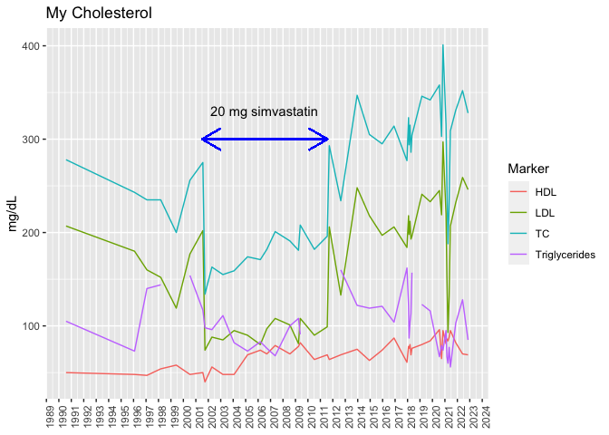

---
Project:
  Render:
    port: 4200
title: Using qselfr for self-tracking
toc-title: Table of contents
---

## Using qselfr

The package [`qselfr`](https://github.com/personalscience/qselfr)
contains a bunch of useful self-tracking functions.

In this example, I'll take information from an Insidetracker CSV
download and generate a useful cholesterol plot.

::: cell
:::

## Example: plot cholesterol

You can add options to executable code like this

::: cell
:::

::: cell
``` {.r .cell-code}
lipids_all<- full_join(blood_history_old,
                       inside_tracker_df %>%
                         select(Date,
                                TC = "Total cholesterol (mg/dL)",
                                LDL = "LDL (mg/dL)" ,
                                HDL = "HDL (mg/dL)" ,
                                Triglycerides = "Triglycerides (mg/dL)" ))
```

::: {.cell-output .cell-output-stderr}
    Joining, by = c("Date", "TC", "HDL", "LDL", "Triglycerides")
:::

``` {.r .cell-code}
lipids <- lipids_all %>% filter(!is.na(Date) & !is.na(LDL))  %>%
  pivot_longer(-Date, names_to = "Marker", values_to = "Value")

lipids %>%
  ggplot(aes(x=Date, y = Value)) +
  geom_line(aes(color = Marker)) +
  labs(title = "My Cholesterol",
       y = "mg/dL",
       x = NULL) +

  geom_segment(aes(y=300,yend=300, x=lubridate::as_date("2001-07-01"),
                   xend=lubridate::as_date("2011-08-01")), color = "blue",
               arrow=arrow(ends="both")) +

  annotate("text", x=lubridate::as_date("2006-07-01"), y = 330, label = "20 mg simvastatin") +

  scale_x_date(date_breaks = "1 year", date_labels = "%Y") +
  theme(axis.text.x = element_text(angle = 90, hjust = 1))
```

::: cell-output-display

:::
:::
